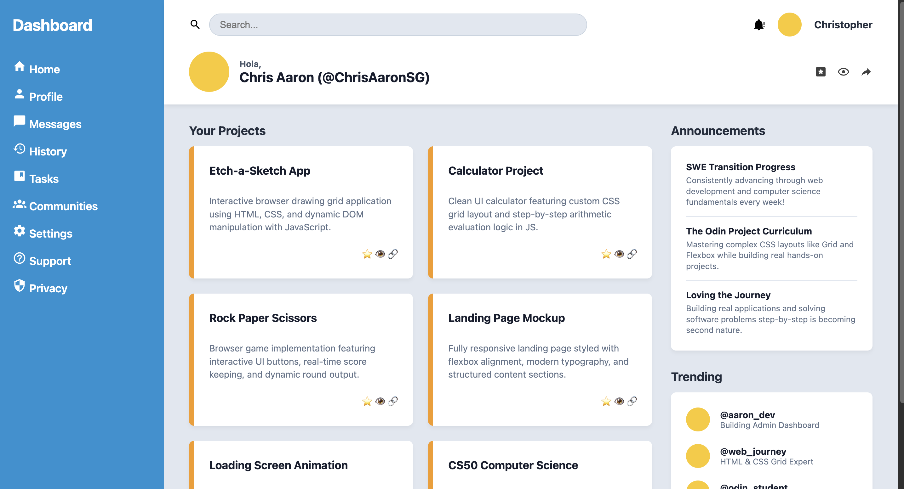

# Admin Dashboard — The Odin Project

A responsive, modern Admin Dashboard layout built as part of [The Odin Project](https://www.theodinproject.com/) curriculum. This project demonstrates intermediate CSS layout techniques, utilizing CSS Grid and Flexbox to build a structured, dynamic web interface based on a real-world design mockup.



---

## 🚀 Live Demo

[View Live Project](https://chriistopheraaron.github.io/admin-dashboard/)

---

## 🛠️ Features & Highlights

- **CSS Grid & Flexbox Architecture:** Two-column dashboard layout (Sidebar vs. Main Area) with sub-grid structures for header actions and card views.
- **Two-Tier Header:** Top row search bar and user controls paired with a dynamic greeting and quick action buttons.
- **Responsive Card Grid:** Project cards structured with CSS Grid (`repeat(auto-fit, minmax(...))`) and accented border styling.
- **Icon Asset Integration:** Custom SVG icons sourced from [Material Design Icons](https://pictogrammers.com/library/mdi/) for visual clarity and alignment.
- **Personalized Context:** Custom project cards highlighting full-stack projects, CS50 coursework, and software engineering milestones.

---

## 🧰 Tech Stack

* **HTML5:** Semantic document structure (`<aside>`, `<header>`, `<main>`).
* **CSS3:** Custom styles utilizing CSS Grid, Flexbox alignment, CSS keyframe properties, and CSS filter utilities.
* **Git & GitHub:** Version control, continuous commits, and GitHub Pages deployment.

---

## 📁 Project Structure

```text
admin-dashboard/
├── icons/                 # Material Design SVG icons
│   ├── account-group.svg
│   ├── account.svg
│   ├── bell.svg
│   ├── bookmark-box.svg
│   ├── cog.svg
│   ├── eye.svg
│   ├── help-circle-outline.svg
│   ├── history.svg
│   ├── home.svg
│   ├── magnify.svg
│   ├── message.svg
│   ├── security.svg
│   ├── share.svg
│   ├── star.svg
│   └── view-dashboard.svg
├── index.html             # Semantic HTML5 layout
├── preview.png            # Dashboard preview screenshot
├── README.md              # Project documentation
├── script.js              # Project JavaScript file
└── style.css              # Custom CSS Grid & Flexbox rules

## 👤 Author

**Chris Aaron** — [@ChriistopherAaron](https://github.com/ChriistopherAaron)